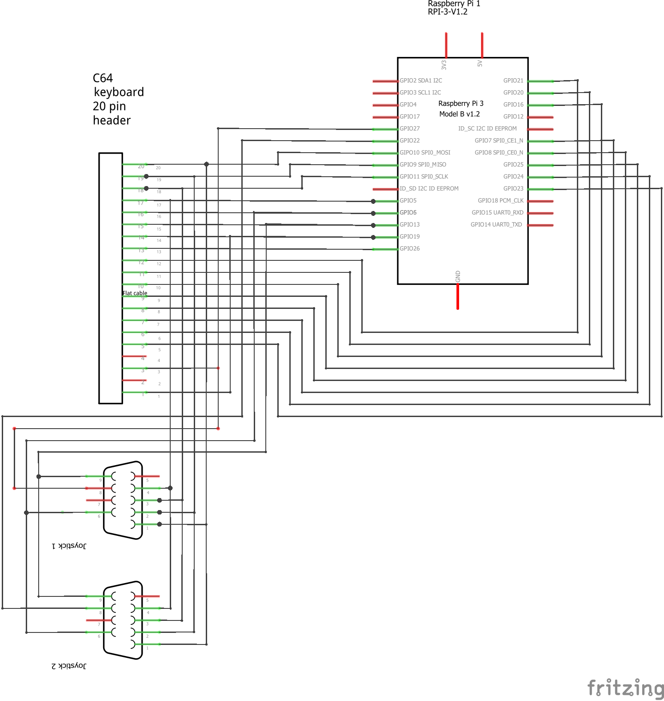
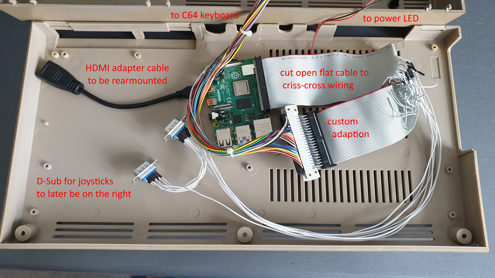

# Introduction

This is a fork of https://github.com/adafruit/Adafruit-Retrogame by having added code
from https://github.com/dabonetn/C64USBKey/ to allow direct attachment of a **C64 keyboard
and up to two joysticks** to your Raspberry Pi without the use of another controller.

Work in progress!

# Details

As discussed in https://www.lemon64.com/forum/viewtopic.php?t=55650 and
https://www.lemon64.com/forum/viewtopic.php?t=70692 a keyboard of a Commodore 64 home
computer (and similar ones) consists of a wired matrix allowing the use of 8 outputs and
8 inputs. By adding two more inputs the matrix is extended from 80 to a hundred possible
switches (keys, buttons and digital four-way-sticks) for the full keyboard and two
Atari compatible joysticks. A second fire button would be possible, personally I'm not
using it since the C64 makes no use of it.

# Status

* The wiring involves a male-to-male adapter on the side of the C64 keyboard connector.
  This ensures complete disassembly of this project to resume operation of the original
  hardware &ndash; if ever needed. In my case this adapter makes pins 1..20 connect
  all even numbered pins of a standard 40 pin flat cable &ndash; used in the years of
  IDE hard disk drives.
* The Adafruit-Retrogame allows proper configuring. My yet trial project ist still hard
  coded. Moving stuff to the .cfg is in the plans.
* Adafruit's is highly optimised to not load the CPU making use of interrupt triggered
  input reading. This sure no longer is possible whilst continuous strobing of outputs
  to have constantly updated input states. This makes this userland driver draining a
  Raspi 4 at almost 10% CPU load. - Any suggestions welcome.
* Of course I will also need Adafruit's full consent to use their code in this project.
  However, I could not find any license information over at their site. I will simply
  ask before uploading any releases here.

# To do

* The driver does not yet provide support for the C64's power LED. This will come as
  soon as the power handling with some sort of onoff shim is done.
* Since this project has its focus on the C64 and Vice emulator some configs need
  tweaking and adding to the repository.
* As mentioned above the timing needs optimising as possible. Considerably Vice does
  delays of keyboard holded keys entirely by itself and joystick inputs need none of
  this. That being said the keyboard should be used in the console and other programmes
  as well. Hence a proper keyboard delay and repeat mode is to be implmented.
* I'm really keen adding more key combos. Maybe making them configurable would be a
  thing.
* Localisation for Vice is nothing since it handles the C64 rather natively. Back in the
  console interchanging the `y` and the `z` key relies on the keyboard driver people
  complained over at dabonetn's repository about it to an understandable extent.
